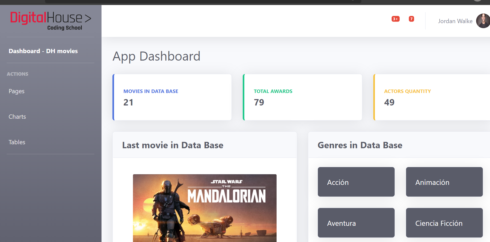

### Creando una aplicación con REACT!!
#### React es una librería JavaScript de código abierto enfocada en la visualización y desarrollada por Facebook. Esta librería brinda muchas ventajas en performance, modularidad y promueve un flujo de datos y eventos muy claro, lo que facilita la planeación y el desarrollo de apps complejas.
#### En esta ejercitación migramos, por asi decirlo, una sencilla estructura HTML + CSS, tipo tablero administrativo (dashboard), a una aplicación de React.
